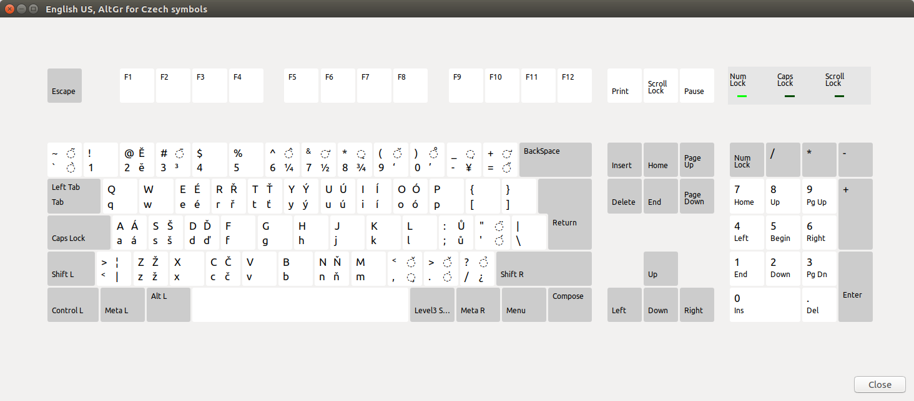

## Features

Default US keyboard with all Czech diacritic characters with GrAlt 
<p align="center">

</p>

## Quickstart

copy scprog to /usr/share/X11/xkb/symbols

```shell
sudo cp ./scprog /usr/share/X11/xkb/symbols
```

Add next code to "/usr/share/X11/xkb/rules/evdev.xml", put it into tag "layoutlist".
```xml
<layout>
    <configItem>
        <name>csprog</name>
        <shortDescription>en_cs</shortDescription>
        <description>English US, AltGr for Czech symbols</description>
        <languageList>
            <iso639Id>eng</iso639Id>
            <iso639Id>cze</iso639Id>
        </languageList>
    </configItem>
</layout>
```

Reboot the system.

Add keyboard called "English US, AltGr for Czech symbols"